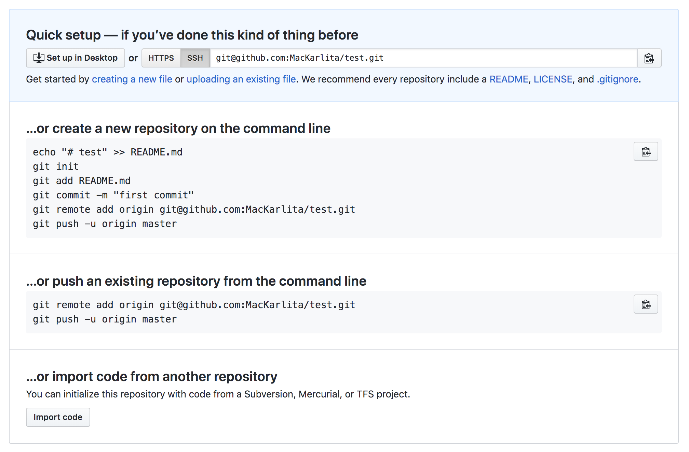

# Proyecto Introductorio

## Ejercicio 1: Crear mi propio repositorio en github

__Objetivo:__ Aprender a crear un proyecto básico de HTML y CSS, y versionarlo con GIT.

##### Crear la base del proyecto en mi ambiente local:

1. Crea una carpeta para mi proyecto, nombrarlo por ejemplo: */my_online_resume*.
2. Crea 2 archivo dentro de mi carpeta: *index.html* y *styles.css*.
3. Abre el proyecto en Virtual Studio Code.
4. Dentro del archivo *index.html* crea la estructura básica de un document HTML.
5. Dentro del archivo *styles.css* configura un color de fondo para el elemento *body*.
6. Importa el archivo de estilos en el documento HTML.
7. Abre el archivo *index.html* en el navegador de tu preferencia (Chrome, Firefox, etc).
8. Comprueba que el estilo que configuraste se haya aplicado correctamente a tu documento HTML.

Una vez que los archivos base del proyecto fueron creados,
el proyecto está listo para configurarlo como un repositorio de GIT.

##### Configurar mi proyecto como un repositorio de GIT

1. Para inicializar tu proyecto local con GIT: `git init` 
2. Abre tu cuenta de github y crea un nuevo repositorio: *Nombre del repositorio, Descripción y Modo Público*.
3. Una vez creado el repositorio, veremos una pantalla como la que sigue:

4. Sigue los pasos de la sección: __...or push an existing repository from the command line__ que indican:
    1. Agregar el remoto a nuestro repositorio local.
    2. Hace el primer commit de nuestra alicación: *git add, git commit & git push...*
5. Verifica en el repositorio de github que tus cambios locales se vean reflejados en el repositorio remoto. 


## Ejercicio 2: Trabajo colaborativo en github

__Objetivos:__ 

- Experimentar el trabajo de varios colaboradores trabajando sobre un mismo branch.
- Ejercicio básico de HTML y CSS.

##### Instrucciones

Crear una página web: Directorio de Estudiantes de WemanConnect

La maquetación debe contener los siguientes elementos:

Header:
- Logo de WeManConnect
- Título de la Página: Directorio de Estudiantes de WeManConnect

Contenido:

- Sección con 10 Tarjetas de contacto
- Los contactos deben estar ordenados en orden alfabético
- Cada Tarjeta de contacto debe llevar la siguiente información:
    - Nombre completo.
    - Email (pueden utilizar uno falso).
    - Fotografía (pueden utilizar una imagen de algún personaje favorito).
    - Una liga a su sitio favorito de internet.
    - Un botón con la leyenda: Conóceme.
- La página debe tener un estilo general para la maquetación, y para la estructura de la tarjeta de contacto.
- Cada tarjeta de contacto debe tener su propio estilo (cada estudiante debe estilizar a su gusto la tarjeta 
que le corresponde de acuerdo al orden alfabético de su nombre).
- Los estilos deben declararse en su propio documento CSS que deberá ser importado en el HTML.
- El botón *Conóceme* debe imprimir en el Panel Console de Chrome DevTools la frase favorita de cada estudiante.
- Para ello, debemos crear un archivo de Javascript e importarlo en el HTML/
- Cada estudiante debe crear su propia función de Javascript para ser utilizada por el botón correspondiente a su card.

Footer:
- Leyenda: Powered by WemanConnect Students 


## Ejercicio 3: Trabajando en mi propio branch

__Objetivos:__
 - Aprender a crear y trabajar en un nuevo branch de mi repositorio
 - Practicar la creación de un Bash Script
 
##### Creación del Nuevo Branch
 
1. Abre la terminal y navega hasta la carpeta del proyecto
2. Verifica el estado de tu repositorio con `git status`. Debes estar situada en el branch `master`.
3. Crea un nuevo branch a partir de `master`. Ejemplo: `git checkout -b  kmartin_bashscript`.
4. Verifica con `git status` que estés situada en el nuevo branch. Ej: `On branch kmartin_bashscript`.
5. Sube el nuevo branch al repositorio remoto: `git push -u origin kmartin_bashscript` 
6. Estás lista para empezar a trabajar en el nuevo branch.
 
##### Pasos para crear un Bash Script

1. Verifica con `git status` que estás trabajando en el nuevo branch.
2. Crea un nuevo archivo con la extensión `.ssh`. Ejemplo: `touch my_bash.sh`
3. Abre el proyecto en Virtual Studio Code para editar el bash script.
4. Contenido del archivo:
    1. El script debe ser capaz de leer desde el CLI un nombre e imprimir un mensaje de saludo. 
    El código es el siguiente:
    
        ```
        read -p "May I know your name, please?" name  
        echo "Hello $name, Welcome to WemanConnect Bootcamp!"
        ```
    
    2. Consulta la presentación o tus notas de la clase de CLI para recordar cuál tiene que ser la primera línea 
     de este archivo para ser considerado un Bash script, y complétalo.
5. Regresa a la terminal y verifica los permisos del archivo (consulta tus notas para recordar cómo hacerlo).
6. Si el archivo no tiene permisos de ejecución, proporciónalos con `chmod +x my_bash.sh`
7. Una vez que el código del script esté completo, y el archivo tenga permisos de ejecución, córrelo desde 
la terminal utilizando uno de los siguientes comandos:
    
    `./my_bash.sh`
    
    `sh my_bash.sh`
    
    `bash my_bash.sh`

8. El resultado esperado es: la terminal debe mostrarnos el mensaje "May I know your name, please?" y esperar 
a que introduzcamos un nombre en la pantalla, ejemplo: Karla. Una vez que introducimos el nombre debe desplegar el mensaje de
saludo "Hello Karla, Welcome to WemanConnect Bootcamp!".
9. Si todo sale bien, sube tus cambios al repositorio, y comprueba que se subieron consultando tu cuenta de github.


## Enlaces de Interés

Libro en formato electrónico de GIT: https://git-scm.com/book/es/v2

Documentación de Chrome DevTools (disponible en español cambiando el idioma): https://developers.google.com/web/tools/chrome-devtools#open

Conectar a Github con SSH: https://help.github.com/es/enterprise/2.16/user/github/authenticating-to-github/connecting-to-github-with-ssh

Con respecto a este tema, SSH es un protocolo seguro que se utiliza generalmente cuando se trabaja con los servidores
internos del cliente. No es necesario para realizar los ejercicios, pero importante de saber al trabajar en un proyecto
del mundo real. La liga proporcionada contiene información sobre qué es SSH, cómo generar la clave y como agregarla
en nuestra cuenta de github.

Sintaxis para escribir un archivo README: https://help.github.com/es/github/writing-on-github/basic-writing-and-formatting-syntax 

Tips:

Recuerden que no tienen que aprenderse de memoria todos los comandos, incluso los desarrolladores
Senior consultan la documentación todo el tiempo. Así que no olviden revisar:

- Material Pre-bootcamp
- Las Presentaciones de las clases
- Sus apuntes personales
- La Documentación que existe en internet